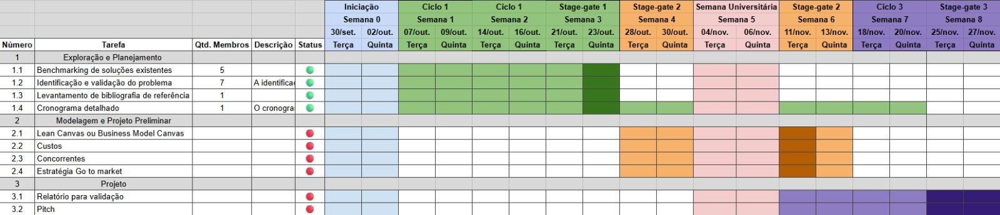
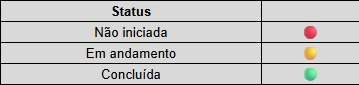

# Cronograma

&emsp;&emsp;
O cronograma foi criado para registrar de forma estruturada todas as atividades já concluídas, bem como orientar a equipe quanto às tarefas ainda pendentes. Dessa forma, é possível oferecer uma visão clara do andamento do projeto, permitindo um acompanhamento contínuo do progresso e o cumprimento dos prazos estabelecidos. Além disso, o cronograma serve como instrumento de planejamento e controle, favorecendo a organização interna, a distribuição equilibrada das responsabilidades e a coordenação eficiente entre os membros da equipe.

 

  
   
  <em>Figura 1 – Planilha do cronograma</em>

  
   
  <em>Figura 2 – Legenda</em>

 

[Clique aqui para acessar a planilha](https://docs.google.com/spreadsheets/d/1VT45WTBT1SgYrhP1Jlpoc6VQcMbb-Gq6lePhwKYwa1k/edit?usp=sharing)

## Descrição das atividades realizadas

### 1. Identificação e validação do problema 

&emsp;&emsp;
A identificação e validação do problema foram elaboradas com base na contextualização apresentada pelo professor em sala, sendo fortemente amparadas pelos moldes estabelecidos no roteiro do projeto e alinhadas aos padrões necessários para atribuição de nota 10 a este entregável. Dessa forma, a equipe utilizou os primeiros dias (02/10/2025 a 09/10/2025) para realizar um aprofundamento e pesquisa sobre o funcionamento, as demandas e os principais desafios da avicultura praticada no Distrito Federal. Inicialmente, o foco foi compreender o setor a ser explorado em termos de oportunidades, e, em seguida, buscar dados que embasassem esses fatores e justificassem possíveis intervenções e soluções de engenharia. Posteriormente, foi destinado um dia (10 de outubro) para a redação da seção “Identificação e Validação do Problema”, requerida no Stage-Gate 1, e para sua inserção no GitHub Pages. Por fim, a equipe incluiu as informações mais relevantes deste entregável nos slides para fins de apresentação.

### 2. Cronograma

&emsp;&emsp;
O cronograma foi desenvolvido em uma planilha, tomando como base o cronograma oficial fornecido pelo professor, que indica as datas de Stage-Gates e os períodos de cada ciclo do projeto. Construímos um modelo inicial, porém tivemos que fazer alguns ajustes na duração das semanas conforme as alterações de datas informadas posteriormente, garantindo que todas as etapas permanecessem alinhadas ao andamento da disciplina. O nosso cronograma possui todas as atividades que serão desenvolvidas durante o projeto, assim como as informações de quantidade de membros alocados por tarefa, duração dos ciclos, datas das apresentações, status da tarefa (verde = concluída, amarelo = em andamento, vermelho = não iniciada) e a descrição das atividades.

